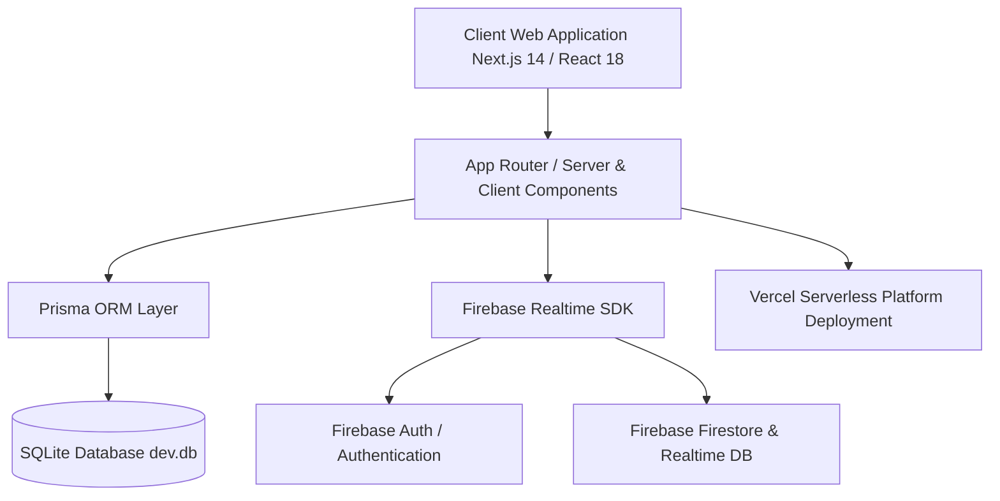

# 🎓 V.S.B. Engineering College - Admission CRM & Lead Management System
## Technical Architecture, Module Guide & Knowledge Base

---

## 📌 1. Executive Summary

The **V.S.B. Engineering College Admission CRM & Lead Management System** is an enterprise-grade, high-performance web platform engineered for institutional lead tracking, automated faculty lead distribution, omnichannel marketing campaign analytics, real-time student admissions monitoring, and fee payment verification across **Karur (TNEA Code: VSB-612)** and **Coimbatore (TNEA Code: VSB-714)** campuses.

This application acts as a unified digital nerve center connecting admissions counselors, administrative leadership, and department faculty members.

---

## 🏗️ 2. System Architecture & Technology Stack



### 💻 Technology Stack Matrix
| Layer | Technology | Description |
| :--- | :--- | :--- |
| **Frontend Framework** | **Next.js 14.1 (App Router)** | Server & Client Components with React 18 |
| **Styling & Design System** | **TailwindCSS + Custom Glassmorphism** | Responsive HSL color tokens, dark mode & liquid glass cards |
| **Database & ORM** | **Prisma 5.22 + SQLite (`dev.db`)** | Local persistent database storage with zero external dependencies |
| **Real-time & Cloud Sync** | **Firebase SDK (Auth, Firestore, RTDB)** | Real-time session auth & cloud student data synchronization |
| **Iconography & Visuals** | **Lucide React + Custom Canvas (OGL)** | High-contrast UI badges, interactive specular buttons & icons |
| **Deployment Engine** | **Vercel Cloud Platform (`vercel.json`)** | Automatic production builds (`prisma generate && next build`) |

---

## 🗝️ 3. Core Credentials & User Access Matrix

| Account Role | Username / User ID | Default Password | Access Level & Campus |
| :--- | :--- | :--- | :--- |
| **Karur System Admin** | `adminkarur@123` | `vsbec@123` | Full Administrative Access (Karur Campus) |
| **Coimbatore System Admin** | `admincovai@123` | `vsbectc@1213` | Full Administrative Access (Coimbatore Campus) |
| **Faculty Lead (P. Rajesh)** | `rajesh.mech@vsbec.in` | `rajesh@vsb2026` | Mechanical Engineering Faculty (Karur) |
| **Faculty Lead (Dr. Arulmurugan)** | `arulmurugan.cse@vsbec.in` | `arul@vsb2026` | Computer Science & Engineering (Karur) |
| **Faculty Lead (Dr. Meenakshi)** | `meenakshi.ece@vsbec.in` | `meenakshi@vsb2026` | Electronics & Communication (Coimbatore) |
| **Faculty Lead (Dr. Gayathri)** | `gayathri.it@vsbec.in` | `gayathri@vsb2026` | Information Technology (Karur) |
| **Karur Faculty General** | `teacherkarur@123` | `vsbteacher@123` | Faculty Lead Access (Karur) |
| **Coimbatore Faculty General** | `teachercovai@123` | `vsbteacher@1213` | Faculty Lead Access (Coimbatore) |

---

## 🧩 4. System Modules & Functional Capabilities

### 📊 Module 1: Admissions CRM Dashboard
- **Metric Cards**: Dynamic aggregation of Total TNEA Leads (28 Total Database Leads), Verified Marksheets (10), Confirmed Enrolment (5), and Fee Receipts (₹4,75,000).
- **VSB TNEA Lead Conversion Funnel**: Interactive stage filtering across 5 core pipeline stages:
  - **New Inquiry** (11 Candidates / 39.3% Pipeline)
  - **Contacted** (6 Candidates)
  - **Cutoff Review** (5 Candidates)
  - **Admitted** (5 Candidates)
  - **Rejected** (1 Candidate)
- **Recent Applicants Table**: Live applicant sorting, campus tag (`KARUR` / `COIMBATORE`), TNEA cutoff scores, and quick contact action buttons.
- **Counselor Reminders Panel**: Follow-up panel tracking pending call logs and WhatsApp reminders.

---

### 📇 Module 2: Contact Directory / Lead Manager
- **Student Database**: Tracks 28 lead records with complete student candidate profiles (Name, Email, Mobile, School, District, 10th/12th Marks, TNEA Cutoff, Stage Status).
- **Lead Creation & Entry**:
  - **`+ Add Quick Lead` Modal**: Fast registration of new candidate inquiries.
  - **`+ New Application` Modal**: Comprehensive student registration including family background, community (BC/MBC/SC), and department choice.
  - **`📥 Import CSV` Handler**: Automated parser converting bulk CSV files into verified student leads and saving directly into the database.
- **Voice Call Audio Inspector**: `📞 Daily Call Analytics & Audio Audit` drawer modal featuring HTML5 voice recording player, animated speech waveforms, automated transcripts, and call outcome notes.

---

### 👨‍🏫 Module 3: Teacher Directory & Quota Allocation
- **16 Faculty Profile Cards**: Complete directory of V.S.B. department heads and professors.
- **Assigned Contact Range Badges**: Precise lead allocations displayed on every faculty card:
  - `🎯 Contacts #1 to #100` (P. Rajesh - Mechanical)
  - `🎯 Contacts #101 to #200` (Dr. Arulmurugan - CSE)
  - `🎯 Contacts #201 to #300` (Dr. Meenakshi - ECE)
  - `🎯 Contacts #301 to #400` (Dr. Gayathri - IT)
  - ... up to `#901 to #1000`.
- **Admin Lead Allocation Banner & Split Tool**:
  - `⚡ Split Contacts to Teacher`: Modal allowing administrators to select start numbers and split batch sizes to dynamically reassign lead ranges among faculty members.

---

### 📢 Module 4: Social Media & Omnichannel Contact Platform
Clicking any social platform icon immediately filters and displays live candidate counts and candidate student lists:
- 📣 **Google & Social Ads** (520 Students) - Search & YouTube ad candidate leads.
- 🔗 **Facebook** (340 Students) - Page & Messenger lead gen candidates.
- 💬 **WhatsApp Business** (410 Students) - Direct chatbot & broadcast inquiries.
- 🕊️ **X (Twitter)** (180 Students) - TNEA rank predictor tweet responses.
- ✉️ **E-mail Portal** (210 Students) - Cutoff newsletter campaign leads.
- 📱 **SMS Gateway** (140 Students) - Automated SMS alert responses.
- ✨ **Campaign Hub** (390 Students) - Mega admission drive candidates.
- 🏆 **Project Expo** (250 Students) - School science project expo spot registrants.

---

### ⚙️ Module 5: Admin Settings Console
- **System Appearance**: Theme mode switcher between Light Theme (☀️) and Dark Theme (🌙).
- **Admin Credentials & Security**:
  - Allows administrators to update their **Admin User ID / Username** and **Password** (`vsb_admin_karur_id`, `vsb_admin_coimbatore_id`).
  - Active Account Details status box displaying current logged-in username in high-contrast bold black font.

---

## 🗄️ 5. Database Schema & Data Models

The local database is powered by **SQLite (`prisma/dev.db`)** via **Prisma ORM**:

```prisma
model User {
  id        String   @id @default(uuid())
  name      String
  email     String   @unique
  role      String   @default("COUNSELOR")
  createdAt DateTime @default(now())
}

model Lead {
  id             String   @id @default(uuid())
  name           String
  email          String
  phone          String
  source         String   @default("TNEA Counselling")
  courseInterest String
  campus         String   @default("KARUR")
  status         String   @default("NEW")
  createdAt      DateTime @default(now())
}

model Application {
  id            String   @id @default(uuid())
  leadId        String   @unique
  stage         String   @default("INQUIRY")
  marks10th     Float
  marks12th     Float
  paymentStatus String   @default("PENDING")
}

model Teacher {
  id              String   @id @default(uuid())
  name            String
  email           String   @unique
  phone           String
  department      String
  campus          String   @default("KARUR")
  coursesAssigned String   @default("[]")
  assignedQuota   Int      @default(1000)
}
```

---

## 🚀 6. Deployment & Environment Setup

### 1. Local Development
```bash
# Install dependencies
npm install

# Push database schema & seed SQLite database
npx prisma db push
npx prisma db seed

# Run Next.js local server
npm run dev
```

### 2. Vercel Cloud Deployment
- **Repository Link**: [LEAD-MANAGEMENT-SYSTEM GitHub Repository](https://github.com/Nithishkumar-2501/LEAD-MANAGEMENT-SYSTEM)
- **Deployment File**: `vercel.json`
- **Build Command**: `prisma generate && next build`

---

## 🛡️ 7. Knowledge Base Summary & Maintenance Rules
1. **Data Integrity**: All student creations, quick lead entries, and CSV imports persist to SQLite (`prisma/dev.db`) and Firebase Cloud Services in real time.
2. **UI Design System**: All action buttons and badge labels use high-contrast bold black text for maximum readability.
3. **Non-Breaking Architecture**: All modifications preserve existing codebase components and faculty credential mappings.
