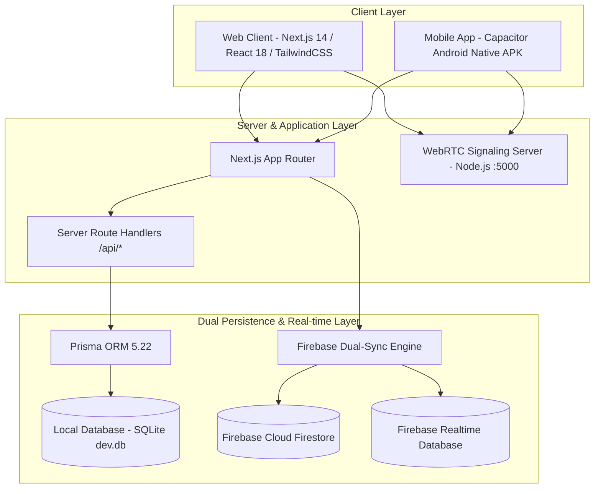

# 🎓 V.S.B. Engineering College - Admission CRM & Lead Management System (SPHEREX)
## Comprehensive Technical Documentation, Architecture Guide & Master Knowledge Base

> **Project Title:** SPHEREX — Intelligent Admission CRM & Omnichannel Lead Management System  
> **Institution:** V.S.B. Engineering College (Autonomous), Karur & Coimbatore Campuses, Tamil Nadu, India  
> **Developed By:** Department of Artificial Intelligence and Data Science  
> **Platform Support:** Progressive Web Application (Next.js 14) & Native Android App (Capacitor)  
> **Target Academic Year:** 2026 – 2027 Admissions & TNEA Counseling  

---

## 📌 1. Executive Summary & Project Purpose

The **SPHEREX Admission CRM & Lead Management System** is an enterprise-grade full-stack digital platform engineered specifically for **V.S.B. Engineering College** to automate, monitor, and optimize institutional student intake across its two autonomous engineering campuses:

- **Karur Campus (TNEA Counseling Code: VSB-612)** — V.S.B. Engineering College, Karur, Tamil Nadu.
- **Coimbatore Campus (TNEA Counseling Code: VSB-714)** — V.S.B. College of Engineering Technical Campus, Coimbatore, Tamil Nadu.

### Key Objectives
1. **Omnichannel Ingestion:** Capture candidate inquiries from Google Ads, Meta (Instagram/Facebook) Ads, WhatsApp campaigns, School Science Expos, Direct Walk-ins, and TNEA Counseling.
2. **Dynamic Faculty Allocation:** Automatically partition and assign batches of candidate leads to 16+ department heads and senior professors with custom quotas and batch range tracking (e.g., `#1 to #100`, `#101 to #200`).
3. **Structured 3-Sheet Candidate Entry:** Streamline data collection into a fluid 3-sheet workflow covering personal info, parent details, community/religion, and marketing attribution source.
4. **Permanent Dual-Cloud Sync:** Every applicant and teacher record is concurrently stored in local **SQLite** (via Prisma ORM) and synchronized in real time to **Google Firebase** (Firestore & Realtime Database).
5. **Integrated Native Telephony & Voice Audio Audit:** Direct click-to-dial (`tel:` protocol), direct WhatsApp chat launching, WebRTC peer-to-peer audio calls, and audio audit player with dynamic waveforms and transcription notes.
6. **AI-Powered Candidate Analysis (Nora AI):** In-app generative intelligence for automated marksheet OCR, cutoff eligibility assessment, and student propensity prediction.

---

## 🏗️ 2. System Architecture & Data Flow



### Dual-Persistence Paradigm
1. **Local-First Speed:** Reads and writes execute against local SQLite via Prisma with sub-millisecond response times.
2. **Cloud Real-Time Sync:** Background listeners (`onSnapshot` and RTDB event refs) synchronize student records and teacher profiles across all connected client devices (browsers, tablets, and Android smartphones) without manual page refreshes.
3. **Offline Resilience:** If network connectivity drops, changes are cached locally and synced to Firebase automatically once reconnected.

---

## 💻 3. Technology Stack Matrix

| Layer | Technology | Version | Purpose & Implementation Details |
| :--- | :--- | :--- | :--- |
| **Frontend Framework** | **Next.js (App Router)** | `14.1.0` | React Server Components, client controllers, fast page navigation |
| **UI Library** | **React** | `18.2.0` | Declarative UI, complex state trees (`useState`, `useEffect`, `useCallback`) |
| **Styling & Theme** | **TailwindCSS + Custom Glassmorphism** | `3.4.1` | Tailored HSL colors, ultra-smooth dark/light mode, backdrop blur cards |
| **Visual Effects** | **OGL (Minimal WebGL)** | `1.0.11` | Specular 3D interactive light buttons (`SpecularButton.tsx`) |
| **Iconography** | **Lucide React** | `0.344.0` | High-contrast UI badges, status indicators, and SVG icons |
| **Database & ORM** | **Prisma ORM + SQLite** | `5.22.0` | Relational schema definitions (`prisma/schema.prisma`), zero-setup local storage |
| **Cloud Synchronization** | **Google Firebase SDK** | `12.18.0` | Cloud Firestore (`students`, `teachers`) & Realtime Database |
| **Mobile Runtime** | **Capacitor Android** | `8.5.1` | Native Android packaging, Gradle build pipeline (`SPHEREX.apk`) |
| **Voice & Telephony** | **WebRTC + WebSocket** | Node.js | In-browser audio streaming, audio waveforms, call transcripts |
| **Language** | **TypeScript** | `5.3.3` | Strict type safety for leads, teachers, applications, and tasks |
| **Deployment Engine** | **Vercel Serverless** | Latest | Production cloud hosting (`vercel.json`) with auto Prisma generation |

---

## 🔑 4. User Roles & Access Control Matrix

The platform incorporates role-based access control (RBAC) segregated by campus and administrative privilege:

| Role | Username / User ID | Default Password | Campus | Scope & Permissions |
| :--- | :--- | :--- | :--- | :--- |
| **Karur System Admin** | `adminkarur@123` | `vsbec@123` | Karur (VSB-612) | Master administrative control, lead splitting, faculty quota management, system settings |
| **Coimbatore System Admin** | `admincovai@123` | `vsbectc@1213` | Coimbatore (VSB-714) | Administrative control for Coimbatore campus, faculty allocations, fee verifications |
| **Faculty Lead (P. Rajesh)** | `rajesh.mech@vsbec.in` | `rajesh@vsb2026` | Karur | Head of Mechanical Engg; manages assigned contact batches |
| **Faculty Lead (Dr. Arulmurugan)** | `arulmurugan.cse@vsbec.in` | `arul@vsb2026` | Karur | Head of CSE; student counseling & cutoff evaluations |
| **Faculty Lead (Dr. Meenakshi)** | `meenakshi.ece@vsbec.in` | `meenakshi@vsb2026` | Coimbatore | Head of ECE; Coimbatore counseling admissions & follow-ups |
| **Faculty Lead (Dr. Gayathri)** | `gayathri.it@vsbec.in` | `gayathri@vsb2026` | Karur | Head of Information Technology; candidate conversion monitoring |
| **General Karur Faculty** | `teacherkarur@123` | `vsbteacher@123` | Karur | General counselor access to Karur student directories |
| **General Coimbatore Faculty** | `teachercovai@123` | `vsbteacher@1213` | Coimbatore | General counselor access to Coimbatore student directories |

---

## 🧩 5. Core System Modules & Functional Guide

### 📊 Module 1: Admissions CRM Dashboard
- **Executive KPI Cards**: Real-time aggregation of Total Leads, Verified Marksheets, Confirmed Enrolments, and Admission Fees collected (₹).
- **TNEA Conversion Funnel**: 5-stage student progression tracker:
  1. `NEW` — Fresh applicant inquiry from campaigns or walk-ins.
  2. `CONTACTED` — Initial phone call or WhatsApp message completed by counselor.
  3. `IN_REVIEW` — 10th/12th marks verified; TNEA cutoff calculated.
  4. `ADMITTED` — Seat booked, fee advance paid, admission confirmed.
  5. `REJECTED` — Candidate chose another college or did not meet eligibility.
- **Campus Selector**: Instant global toggle between **Karur** and **Coimbatore** updating all metrics, tables, and lead assignments.

---

### 📇 Module 2: Contact Directory & Lead Manager
- **Dynamic Table & Card Views**: View candidates in a data-dense customizable spreadsheet table or responsive tactile cards.
- **Customizable Columns**: Toggle visibility for 18+ fields (Name, Email, Mobile, District, State, Cutoff, Community, Blood Group, Discovery Source, Registration Date, Lead Stage).
- **Quick Communication Triggers**:
  - 📞 **Dial Pad**: Launches phone dialer using `tel:+91...`
  - 💬 **WhatsApp**: Launches WhatsApp Web or native WhatsApp App with pre-filled institutional greeting text.
  - 📱 **SMS**: Launches native SMS app with admission details.
  - 📧 **Email**: Opens institutional mail client.
- **Nora AI Mini-Inspector**: One-click AI prompt launcher from any contact row.

---

### 📝 Module 3: Multi-Sheet Candidate Entry System (3 Sheets)
The candidate creation modal utilizes a sequential 3-sheet form to ensure comprehensive data capture:

#### Sheet 1: Student Information
- **Full Legal Name** (required)
- **Student Email** (auto-generates standard institutional fallback if blank)
- **Student Mobile Number**: Compulsory `+91-` prefix locked in UI; validates exactly 10 Indian digits.
- **Gender**: `Male` | `Female` | `Other`
- **Date of Birth**: Native calendar picker
- **Blood Group**: `O+`, `A+`, `B+`, `AB+`, `O-`, `A-`, `B-`, `AB-`
- **School Name**: Higher Secondary / Matriculation school
- **District**: Dropdown populated with all 38 Tamil Nadu districts.
- **State**: Dropdown populated with Indian states (default: *Tamil Nadu*).

#### Sheet 2: Parent Information & Residence
- **Father's Name** & **Mother's Name**
- **Father's Mobile** & **Mother's Mobile**: Compulsory `+91-` prefix validation.
- **Parents' Occupation**: Agriculture, Business, Government Service, IT/Private Sector, Teaching, Laborer, Homemaker, etc.
- **Residential Address**: Full communication street address.

#### Sheet 3: Category, Preferences & Marketing Referral Channel
- **Student Community**: `BC`, `MBC`, `BCM`, `SC`, `SCA`, `ST`, `OC`, `Other`
- **Student Religion**: `Hindu`, `Christian`, `Muslim`, `Jain`, `Sikh`, `Buddhist`, `Other`
- **Interest Status**:
  - 🔥 `Interested` (Ready to admit)
  - ⏳ `Follow-up Needed` (Considering options)
  - ❄️ `Not Interested` (Closed lead)
- **Preferred VSB Campus**: `KARUR` or `COIMBATORE`
- **Course Interest**: Full engineering branches list (AI & DS, CSE, IT, ECE, EEE, Mechanical, Cyber Security, Biotech, Robotics, etc.).
- **College Discovery Source / Referral Channel (📢 Marketing Attribution)**:
  - 📢 `Online Ads (Instagram / Facebook / YouTube)`
  - 💬 `WhatsApp Campaign (Official Chat / Group)`
  - 🌐 `Google Search & College Website`
  - 🏫 `School Visit & Educational Expo`
  - 👥 `Friends, Relatives & Alumni Referral`
  - 📰 `Newspaper, TV & Outdoor Hoardings`
  - 🚶 `Direct Campus Walk-in Enquiry`
  - 🎓 `TNEA Engineering Counselling`
  - ✨ `Other / Custom Referral Source` (reveals text input for specific channel entry)
- **Submission Action**:
  - Clicking **"Submit & Save to Firebase"** writes the complete student dossier directly into **Firebase Firestore** (`students` collection) and **Firebase Realtime Database** (`students/` node), updating all dashboards instantly.

---

### 👨‍🏫 Module 4: Teacher Directory & Quota Allocation
- **16 Full Faculty Profiles**: Detailed cards for department heads across Karur and Coimbatore.
- **Assigned Contact Range Badges**: Visual indicator of assigned student batches (e.g., `🎯 Contacts #1 to #100`, `#101 to #200`).
- **Batch Splitting Tool (`⚡ Split Contacts to Teacher`)**:
  - Administrators can specify start number and quantity (e.g., 100 leads) to instantly allocate batches to selected faculty members.
- **Real-Time Firebase Synchronization**:
  - Teacher records are saved to Firebase Firestore (`teachers/{id}`) and RTDB (`teachers/{id}`).
  - Live listener (`subscribeToFirebaseTeachers`) automatically propagates faculty updates (phone number, department, availability status, assigned quota) across all devices.
  - Header features **"🔥 Sync to Firebase"** button and **"Firebase Live"** status badge.
  - Compulsory `+91-` formatting enforced on all faculty contact numbers.

---

### 📢 Module 5: Omnichannel Marketing & Social Media Hub
Attribution tracking for marketing campaigns with dedicated candidate filtering:
- 📣 **Google & YouTube Ads**
- 🔗 **Facebook & Instagram Campaigns**
- 💬 **WhatsApp Business Broadcasting**
- 🕊️ **X (Twitter) Rank Predictor Campaigns**
- ✉️ **Email Marketing & Cutoff Newsletters**
- 📱 **SMS Alert Gateway**
- 🏆 **School Science Expos & Admission Melas**

---

### 📅 Module 6: Google Calendar & Event Scheduling System
- **Integrated Calendar View**: Full monthly/weekly calendar grid with year (2025–2030) and month navigation.
- **Event Scheduling**: Schedule counseling sessions, campus visits, marksheet review meetings, and admission deadlines.
- **Direct Student Association**: Attach calendar reminders to specific candidate phone numbers and counseling stages.

---

### 🎙️ Module 7: Voice Telephony & WebRTC Audio System
- **Signaling Server**: Node.js WebSocket engine located in `webrtc-voice-system/server.js` (port `5000`).
- **Peer-to-Peer Calling**: In-browser audio streaming between counselors and applicants.
- **Call Inspector Drawer**:
  - Audio playback with interactive waveform visualizer.
  - Call duration, timestamp, and outcome flags (e.g., "Interested in ECE", "Cutoff 194.2").
  - Auto-retention purge engine removing recordings older than 30 days.

---

### 🤖 Module 8: Nora AI Intelligent Lead Assistant
- **Student Profile Analysis**: Summarizes candidate strengths, TNEA cutoff viability, and scholarship recommendations.
- **OCR Marksheet Scanner**: Extract marks from uploaded 10th and 12th marksheets to compute official TNEA cutoff:
  $$\text{Cutoff} = \text{Maths} + \frac{\text{Physics}}{2} + \frac{\text{Chemistry}}{2}$$
- **Interactive Chat Interface**: Ask contextual questions regarding student admissions, seat matrices, and fee structures.

---

### ⚙️ Module 9: Admin Settings & Security Console
- **Appearance**: Dark Mode (🌙) and Light Mode (☀️) toggle with instant DOM synchronization.
- **Credentials Manager**: Update Karur Admin (`adminkarur@123`) and Coimbatore Admin (`admincovai@123`) usernames and passwords.
- **Database Maintenance**: Reseed database, clear local storage cache, and force Firebase push.

---

## 🗄️ 6. Database Schema & Data Models

### Prisma SQLite Schema (`prisma/schema.prisma`)

```prisma
datasource db {
  provider = "sqlite"
  url      = "file:./dev.db"
}

generator client {
  provider = "prisma-client-js"
}

model User {
  id        String   @id @default(uuid())
  name      String
  email     String   @unique
  role      String   @default("COUNSELOR") // ADMIN | TEACHER | COUNSELOR
  createdAt DateTime @default(now())
}

model Lead {
  id                   String       @id @default(uuid())
  name                 String
  email                String
  phone                String       // Compulsory +91-XXXXXXXXXX
  alternatePhone       String?
  fatherName           String?
  motherName           String?
  fatherMobile         String?      // Compulsory +91-XXXXXXXXXX
  motherMobile         String?      // Compulsory +91-XXXXXXXXXX
  gender               String?      // Male | Female | Other
  dob                  String?
  bloodGroup           String?
  community            String?      // BC | MBC | BCM | SC | SCA | ST | OC
  religion             String?      // Hindu | Christian | Muslim | etc.
  address              String?
  parentsWork          String?
  source               String       @default("Online Ads (Instagram / Facebook / YouTube)")
  courseInterest       String
  campus               String       @default("KARUR") // KARUR | COIMBATORE
  school               String?
  district             String?
  state                String?      @default("Tamil Nadu")
  status               String       @default("NEW")   // NEW | CONTACTED | IN_REVIEW | ADMITTED | REJECTED
  interestStatus       String?      @default("Interested")
  counselorId          String?
  assignedTo           String?
  counsellingAppNo     String?
  tneaCutoff           Float?
  counsellingCategory  String?
  createdAt            DateTime     @default(now())
  application          Application?
}

model Application {
  id            String   @id @default(uuid())
  leadId        String   @unique
  lead          Lead     @relation(fields: [leadId], references: [id], onDelete: Cascade)
  stage         String   @default("INQUIRY")
  marks10th     Float?
  marks12th     Float?
  paymentStatus String   @default("PENDING") // PENDING | VERIFIED | COMPLETED
  createdAt     DateTime @default(now())
}

model Teacher {
  id              String   @id @default(uuid())
  name            String
  email           String   @unique
  phone           String   // Compulsory +91-XXXXXXXXXX
  department      String
  campus          String   @default("KARUR")
  coursesAssigned String   @default("[]")
  assignedQuota   Int      @default(1000)
  status          String   @default("ACTIVE") // ACTIVE | ON_LEAVE
  assignedRange   String?
  createdAt       DateTime @default(now())
}

model Task {
  id          String   @id @default(uuid())
  counselorId String
  leadId      String
  title       String
  type        String   // CALL | WHATSAPP | EMAIL | REVIEW
  dueDate     DateTime
  isCompleted Boolean  @default(false)
}

model Payment {
  id        String   @id @default(uuid())
  leadId    String
  amount    Float
  status    String   @default("PENDING") // PENDING | COMPLETED | FAILED
  receiptNo String?
  createdAt DateTime @default(now())
}
```

### Firebase Cloud Data Structures

#### 1. `students/{studentId}` (Firestore & Realtime Database)
```json
{
  "id": "lead_1726478901234",
  "name": "S. Vignesh",
  "email": "vignesh.s@gmail.com",
  "phone": "+91-9876543210",
  "gender": "Male",
  "dob": "2008-05-14",
  "bloodGroup": "O+",
  "school": "St. Joseph Higher Secondary School",
  "district": "Karur",
  "state": "Tamil Nadu",
  "fatherName": "K. Subramanian",
  "motherName": "S. Lakshmi",
  "fatherMobile": "+91-9443322110",
  "motherMobile": "+91-9442211009",
  "parentsWork": "Agriculture / Farming",
  "address": "45/2, Gandhi Road, Thanthonimalai, Karur - 639005",
  "community": "BC",
  "religion": "Hindu",
  "interestStatus": "Interested",
  "source": "Online Ads (Instagram / Facebook / YouTube)",
  "campus": "KARUR",
  "courseInterest": "Artificial Intelligence and Data Science",
  "status": "NEW",
  "createdAt": "2026-09-16T14:20:00.000Z"
}
```

#### 2. `teachers/{teacherId}` (Firestore & Realtime Database)
```json
{
  "id": "arulmurugan.cse@vsbec.in",
  "name": "Dr. K. Arulmurugan",
  "email": "arulmurugan.cse@vsbec.in",
  "phone": "+91-9443322111",
  "department": "Computer Science & Engineering",
  "campus": "KARUR",
  "assignedQuota": 250,
  "status": "ACTIVE",
  "assignedRangeText": "Contacts #101 - #200"
}
```

---

## 📱 7. Mobile Application (Capacitor Android Native)

The SPHEREX mobile app provides admissions officers and faculty with a dedicated Android application optimized for touch navigation and mobile telephony:

- **Package ID:** `com.spherex.collegecrm`
- **Application Name:** `SPHEREX`
- **Framework:** Capacitor Android 8.5.1 with Android SDK 34
- **Pre-Built Debug Binaries:**
  - Root Directory: [`SPHEREX.apk`](file:///e:/FINAL%20YEAR%20PROJECT/CRM%20FILE/SPHEREX.apk)
  - Secondary Alias: [`CRM-Mobile-App.apk`](file:///e:/FINAL%20YEAR%20PROJECT/CRM%20FILE/CRM-Mobile-App.apk)
  - Public Web Download: [`public/SPHEREX.apk`](file:///e:/FINAL%20YEAR%20PROJECT/CRM%20FILE/public/SPHEREX.apk)

### Building the Mobile APK
```powershell
# Step 1: Export Next.js production build and sync with Capacitor
npx cap sync android

# Step 2: Compile native Android Debug APK via Gradle
cmd.exe /c "set JAVA_HOME=C:\Program Files\Android\Android Studio\jbr&& cd android && gradlew.bat assembleDebug"

# Step 3: Copy output APK to root for distribution
Copy-Item "android\app\build\outputs\apk\debug\app-debug.apk" "SPHEREX.apk" -Force
```

---

## 🚀 8. Setup, Installation & Execution Guide

### Prerequisites
- **Node.js**: v18.17.0 or higher
- **NPM**: v9.0.0 or higher
- **Java**: OpenJDK 17 or Android Studio Embedded JBR (for Android builds)
- **Android Studio**: Ladybug / Hedgehog with Android SDK Platform 34

### Quick Start Commands
```powershell
# 1. Clone repository
git clone https://github.com/Nithishkumar-2501/LEAD-MANAGEMENT-SYSTEM.git
cd "CRM FILE"

# 2. Install dependencies
npm install

# 3. Synchronize Prisma SQLite Database
npx prisma db push
npx prisma generate

# 4. Seed initial faculty and student records
npm run prisma:seed

# 5. Start development server
npm run dev
# Application will run at http://localhost:3000
```

### Production Build & Verification
```powershell
# Test Next.js compilation
npm run build

# Start WebRTC signaling server (optional for voice testing)
npm run webrtc
```

---

## 🌐 9. REST API Reference

| Method | Endpoint | Description | Key Parameters / Body |
| :--- | :--- | :--- | :--- |
| `GET` | `/api/contacts` | Fetch all student leads | Optional query params: `campus`, `search`, `status` |
| `POST` | `/api/contacts` | Create a student contact | Student payload (`name`, `phone`, `email`, `source`, etc.) |
| `PUT` | `/api/contacts` | Update an existing student | Updated fields with matching `id` |
| `DELETE` | `/api/contacts` | Delete a student contact | JSON body `{ "id": "<lead_id>" }` |
| `GET` | `/api/teachers` | Fetch all faculty members | Live sync from Firebase Firestore / SQLite |
| `POST` | `/api/teachers` | Add a new faculty member | `{ "name", "email", "phone", "department", "campus" }` |
| `PUT` | `/api/teachers` | Update faculty profile/quota | Updated teacher object |
| `DELETE` | `/api/teachers` | Remove faculty member | JSON body `{ "id": "<teacher_id>" }` |
| `GET` | `/api/dashboard/metrics` | Real-time aggregate KPI counters | Computes totals across Karur & Coimbatore |
| `POST` | `/api/email/send` | Dispatches admission updates | `{ "to", "subject", "htmlContent" }` |
| `POST` | `/api/ai/counselor` | Nora AI admission counselor | `{ "prompt", "context" }` |

---

## 🛡️ 10. Data Integrity Rules & Engineering Standards

1. **Compulsory Phone Format (`+91-` Standard)**:
   - All mobile numbers across students, fathers, mothers, and teachers must conform to `+91-XXXXXXXXXX`.
   - Strips non-digit characters, extracts the 10-digit national number, and prepends `+91-`.
2. **Dual-Cloud Redundancy**:
   - Every creation or edit updates local SQLite and concurrently pushes to Firebase Firestore and Realtime Database.
3. **High-Contrast Design System**:
   - High-contrast text tokens, bold badges, and accessible typography ensure readability across counseling floor displays and mobile devices under outdoor sunlight.
4. **Attribution Integrity**:
   - Lead marketing sources are never overwritten during subsequent edits unless explicitly chosen by an administrator.

---

## 👥 11. Institutional Credits

**V.S.B. Engineering College (Autonomous)**  
*Approved by AICTE, New Delhi & Affiliated to Anna University, Chennai*  
*Accredited by NAAC with 'A' Grade & NBA Accredited Programs*  
- **Karur Campus:** NH-67, Covai Road, Karudayampalayam Post, Karur - 639111.  
- **Coimbatore Campus:** Pollachi Main Road, Eachanari, Coimbatore - 641021.  

**Engineering & Architecture:**  
Developed by the **Department of Artificial Intelligence and Data Science**.
