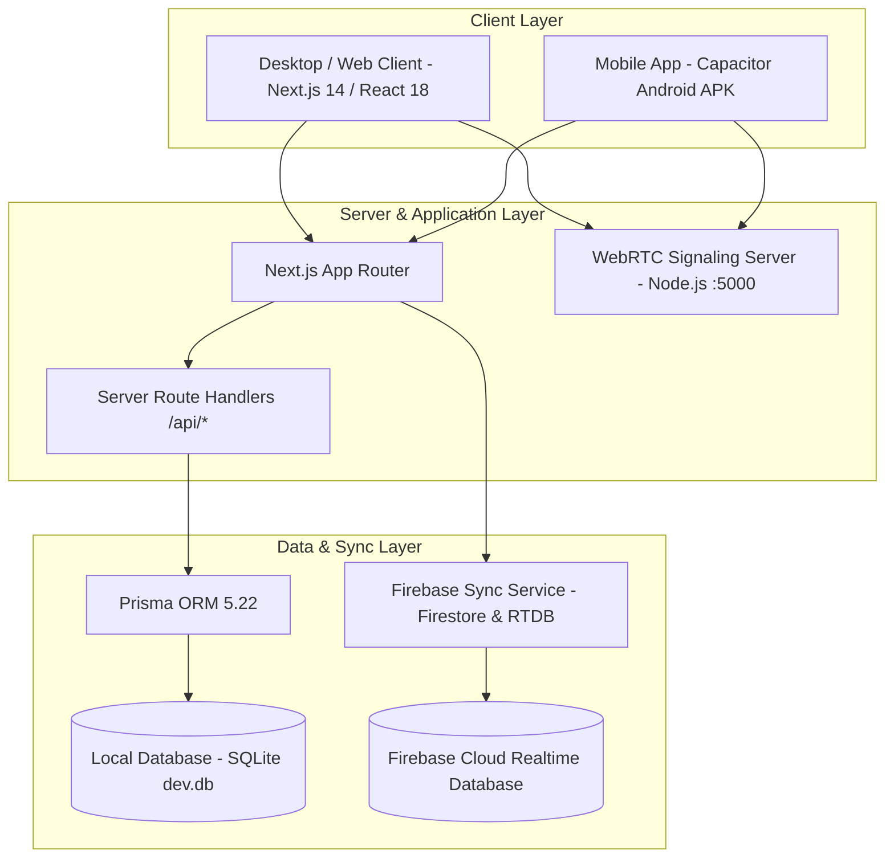

# 🎓 V.S.B. Engineering College - Admission CRM & Lead Management System (SPHEREX)
## Comprehensive Technical Documentation, Architecture Guide & Project Knowledge Base

---

## 📌 1. Project Overview & Executive Summary

The **V.S.B. Engineering College Admission CRM & Lead Management System (SPHEREX)** is an enterprise-grade full-stack web and mobile platform engineered for institutional lead acquisition, dynamic faculty lead quota distribution, omnichannel marketing campaign attribution, real-time student admissions monitoring, and fee payment verification across both **Karur** and **Coimbatore** campuses:

- **Karur Campus (TNEA Counseling Code: VSB-612)**
- **Coimbatore Campus (TNEA Counseling Code: VSB-714)**

This application acts as a unified digital nerve center connecting admissions counselors, administrative leadership, and department faculty members across various academic branches (CSE, IT, ECE, EEE, Mechanical, AI & DS, Cyber Security, etc.).

---

## 🏗️ 2. System Architecture



---

## 💻 3. Technology Stack Matrix

| Layer | Technology | Version | Purpose / Description |
| :--- | :--- | :--- | :--- |
| **Frontend Framework** | **Next.js (App Router)** | `14.1.0` | React 18 server and client components, optimized layouts |
| **UI Library** | **React** | `18.2.0` | State management, hooks (`useState`, `useEffect`, `useCallback`) |
| **Styling & Design** | **TailwindCSS + Custom Glassmorphism** | `3.4.1` | HSL tokens, dark/light theme, liquid glass cards |
| **Visual Effects** | **OGL (Minimal WebGL)** | `1.0.11` | Custom 3D interactive specular light buttons (`SpecularButton.tsx`) |
| **Iconography** | **Lucide React** | `0.344.0` | High-contrast UI badges and dashboard icons |
| **Database & ORM** | **Prisma + SQLite** | `5.22.0` | Relational schema definitions and queries with zero external DB setup |
| **Cloud Real-time Sync** | **Firebase SDK** | `12.18.0` | Cloud Firestore & Realtime Database synchronization |
| **Voice & Telephony** | **WebRTC + WebSocket** | Node.js | Real-time browser-to-browser voice calling, audio recording & waveforms |
| **Mobile Runtime** | **Capacitor Android** | `8.5.1` | Native Android packaging, APK build pipeline (`CRM-Mobile-App.apk`) |
| **Language** | **TypeScript** | `5.3.3` | Type safety for leads, teachers, applications, and tasks |

---

## 🔑 4. User Roles & Access Control Matrix

The system provides segregated access control based on user credentials and assigned campus:

| Role | Username / User ID | Default Password | Access Level & Scope |
| :--- | :--- | :--- | :--- |
| **Karur System Admin** | `adminkarur@123` | `vsbec@123` | Full Administrative Access (Karur Campus) |
| **Coimbatore System Admin** | `admincovai@123` | `vsbectc@1213` | Full Administrative Access (Coimbatore Campus) |
| **Faculty Lead (P. Rajesh)** | `rajesh.mech@vsbec.in` | `rajesh@vsb2026` | Mechanical Engineering Faculty (Karur) |
| **Faculty Lead (Dr. Arulmurugan)** | `arulmurugan.cse@vsbec.in` | `arul@vsb2026` | Computer Science & Engineering (Karur) |
| **Faculty Lead (Dr. Meenakshi)** | `meenakshi.ece@vsbec.in` | `meenakshi@vsb2026` | Electronics & Communication (Coimbatore) |
| **Faculty Lead (Dr. Gayathri)** | `gayathri.it@vsbec.in` | `gayathri@vsb2026` | Information Technology (Karur) |
| **Karur Faculty General** | `teacherkarur@123` | `vsbteacher@123` | General Faculty Access (Karur Campus) |
| **Coimbatore Faculty General** | `teachercovai@123` | `vsbteacher@1213` | General Faculty Access (Coimbatore Campus) |

---

## 🧩 5. Core System Modules & Functional Capabilities

### 1. 📊 Admissions CRM Dashboard
- **Executive Metric Cards**: Dynamic count of Total Inquiries, Verified Marksheets, Confirmed Enrolments, and Fee Receipts (₹).
- **TNEA Lead Conversion Funnel**: 5 core pipeline stages:
  1. `New Inquiry`: Fresh inquiries from ads, website, walk-ins, and expos.
  2. `Contacted`: Counselor or faculty has engaged via call or WhatsApp.
  3. `Cutoff Review`: 10th/12th marks submitted; TNEA cutoff calculated.
  4. `Admitted`: Admission fee paid, seat locked in counseling quota.
  5. `Rejected`: Candidate opted for another college or disqualified.
- **Campus Selector**: Instant live toggle between **Karur (VSB-612)** and **Coimbatore (VSB-714)**.

### 2. 📇 Contact Directory & Lead Manager
- **Student Profile Dossier**: Comprehensive record for each candidate:
  - Personal Information (Name, Phone, Alternate Phone, Email, District, School).
  - Academic Profile (10th Marks, 12th Marks, PCM Breakdown, TNEA Cutoff Score).
  - Quota Category (OC, BC, BCM, MBC, SC, SCA, ST).
  - Campus Preference & Preferred Department.
- **Lead Intake Channels**:
  - **`+ Add Quick Lead` Modal**: Fast, 30-second inquiry capture.
  - **`+ New Application` Modal**: Comprehensive student registration with guardian data.
  - **Bulk CSV Importer**: Automated CSV parsing and mapping directly into SQLite and Firebase.
- **Audio Call Inspector**: Live call audio playback with dynamic waveform visualization, timestamps, duration, and call outcome notes.

### 3. 👨‍🏫 Teacher Directory & Quota Allocation
- **16 Faculty Profile Cards**: Directory of department heads and senior professors.
- **Dynamic Contact Range Splitting**:
  - Automatically slices student database into batches (e.g., `#1 to #100`, `#101 to #200`, `#201 to #300`, etc.).
  - **`⚡ Split Contacts to Teacher` Modal**: Administrators can select starting indexes and split quantities to rebalance counseling loads.
- **Teacher-Student Audit Modal**: Allows department heads to review their assigned students' contact logs and follow-up schedules.

### 4. 📢 Omnichannel Marketing & Lead Attribution
- Direct channel filtering and metrics across major sources:
  - 📣 **Google & YouTube Ads**
  - 🔗 **Facebook & Instagram Lead Generation**
  - 💬 **WhatsApp Business API**
  - 🕊️ **X (Twitter) Rank Predictor Campaigns**
  - ✉️ **Cutoff Newsletter Email Campaigns**
  - 📱 **SMS Alert Gateways**
  - 🏆 **School Science Expo & Walk-in Drives**

### 5. 📞 Voice Calling & WebRTC System
- In-browser WebRTC telephony engine located in `/webrtc-voice-system`:
  - Browser-to-browser peer audio calls between counselors and candidates.
  - Interactive simulated phone dialer with standard `tel:` protocol integration for mobile devices.
  - Call recording logs and audio playback audit features.

### 6. ⚙️ Admin Settings & Security Console
- **Appearance**: Dark Mode (🌙) and Light Mode (☀️) toggle.
- **Credential Management**: Update administrative passwords and usernames for Karur and Coimbatore consoles.
- **Data Maintenance**: Database re-seeding and cache invalidation.

---

## 🗄️ 6. Database Schema & Data Models

Defined in [`prisma/schema.prisma`](file:///e:/FINAL%20YEAR%20PROJECT/CRM%20FILE/prisma/schema.prisma):

```prisma
datasource db {
  provider = "sqlite"
  url      = "file:./dev.db"
}

generator client {
  provider = "prisma-client-js"
}

model User {
  id        String   @id @default(uuid())
  name      String
  email     String   @unique
  role      String   @default("COUNSELOR") // ADMIN | TEACHER | COUNSELOR
  createdAt DateTime @default(now())
}

model Lead {
  id             String   @id @default(uuid())
  name           String
  email          String
  phone          String
  source         String   @default("TNEA Counselling")
  courseInterest String
  campus         String   @default("KARUR")     // KARUR | COIMBATORE
  status         String   @default("NEW")       // NEW | CONTACTED | REVIEW | ADMITTED | REJECTED
  createdAt      DateTime @default(now())
}

model Application {
  id            String   @id @default(uuid())
  leadId        String   @unique
  stage         String   @default("INQUIRY")
  marks10th     Float
  marks12th     Float
  paymentStatus String   @default("PENDING")   // PENDING | VERIFIED | COMPLETED
}

model Teacher {
  id              String   @id @default(uuid())
  name            String
  email           String   @unique
  phone           String
  department      String
  campus          String   @default("KARUR")
  coursesAssigned String   @default("[]")
  assignedQuota   Int      @default(1000)
}
```

---

## 📁 7. Project Directory Structure

```text
CRM FILE/
├── android/                         # Capacitor Native Android Project
│   ├── app/                         # Android application source
│   ├── build.gradle                 # Android build configuration
│   └── gradlew.bat                  # Gradle command-line build tool
├── capacitor.config.json            # Capacitor mobile configuration
├── CRM-Mobile-App.apk               # Pre-compiled Android Debug APK
├── SPHEREX.apk                      # Institutional Release APK
├── prisma/
│   ├── schema.prisma                # Prisma ORM data models
│   ├── dev.db                       # Local SQLite database
│   └── seed.ts                      # Initial data seeding script
├── src/
│   ├── app/
│   │   ├── api/                     # Backend Next.js REST API routes
│   │   │   ├── applications/        # Application CRUD handlers
│   │   │   ├── contacts/            # Leads & contacts query endpoints
│   │   │   ├── dashboard/           # Summary metrics calculation
│   │   │   ├── email/               # Email dispatch endpoint
│   │   │   ├── seed/                # Dynamic DB seed endpoint
│   │   │   ├── tasks/               # Follow-up task management
│   │   │   └── teachers/            # Teacher quota API
│   │   ├── dashboard/               # Main Dashboard App Route
│   │   │   └── page.tsx             # Primary client-side dashboard controller
│   │   ├── globals.css              # Tailwind styles & theme variables
│   │   ├── layout.tsx               # Root application layout
│   │   └── page.tsx                 # Redirect / landing entrypoint
│   ├── components/                  # React modular UI components
│   │   ├── AddQuickLeadModal.tsx    # Fast lead intake modal
│   │   ├── AdminDashboardView.tsx   # Admin dashboard statistics view
│   │   ├── AdminSettingsModule.tsx  # System configurations & passwords
│   │   ├── ApplicantDetailModal.tsx # Full student dossier & cutoff inspector
│   │   ├── ApplicantsTable.tsx      # Paginated, searchable student table
│   │   ├── CampusCourseModule.tsx   # Degree & department catalog
│   │   ├── ContactDirectoryModule.tsx # Primary contact directory & CSV tools
│   │   ├── CreateApplicationModal.tsx# Comprehensive admission application modal
│   │   ├── EchoDashboardView.tsx    # WebRTC call logs and recording audit
│   │   ├── Header.tsx               # Top navigation bar & campus selector
│   │   ├── LeadFunnelChart.tsx      # TNEA admission funnel chart
│   │   ├── LoginModal.tsx           # Authentication modal
│   │   ├── MarketingDashboardView.tsx# Campaign metrics view
│   │   ├── MetricCards.tsx          # KPI metric cards
│   │   ├── PaymentBillingModule.tsx # Admission fee payment records
│   │   ├── Sidebar.tsx              # Main navigation menu
│   │   ├── SocialMediaPlatformModule.tsx # Marketing channels hub
│   │   ├── SpecularButton.tsx       # 3D interactive specular lighting button
│   │   ├── StudentApplicationsModule.tsx # Application review module
│   │   ├── TeacherModule.tsx        # Faculty cards & range badges
│   │   ├── TeacherStudentAuditModal.tsx # Faculty call log inspection modal
│   │   └── UserDashboardView.tsx    # Counselor-specific daily tasks view
│   ├── lib/                         # Utility libraries & helpers
│   │   ├── authService.ts           # Authentication logic
│   │   ├── callDialer.ts            # WebRTC & telephony dialer
│   │   ├── csvParser.ts             # CSV parsing & column mapping
│   │   ├── firebase.ts              # Firebase client initialization
│   │   ├── firebaseSync.ts          # Firestore & RTDB dual sync
│   │   ├── mockData.ts              # Baseline seed & fallback data
│   │   └── prisma.ts                # Prisma client singleton
│   └── types/
│       └── crm.ts                   # Core TypeScript types and interfaces
├── webrtc-voice-system/             # Independent WebRTC Signaling Server
│   ├── server.js                    # Node.js WebSocket signaling server
│   ├── package.json                 # WebRTC server dependencies
│   └── public/                      # Audio test client & recordings
├── package.json                     # NPM packages & build scripts
├── tailwind.config.ts               # Tailwind design system configuration
├── tsconfig.json                    # TypeScript compiler configuration
└── vercel.json                      # Vercel deployment configuration
```

---

## 🚀 8. How to Run, Test, and Build

### 1. Local Web Development Server
```powershell
# Step 1: Install dependencies
npm install

# Step 2: Push database schema & generate Prisma client
npx prisma db push
npx prisma generate

# Step 3: Seed initial faculty and applicant records
npm run prisma:seed

# Step 4: Launch development server (default: http://localhost:3000)
npm run dev
```

### 2. Launch WebRTC Voice Server
```powershell
# Runs on port 5000 for signaling and audio recording
npm run webrtc
```

### 3. Build & Sync Android Mobile App (Capacitor)
```powershell
# Step 1: Compile Next.js and export web assets to Android
npm run build:mobile

# Step 2: Open Android Studio to inspect or debug
npm run cap:open

# Step 3: Directly assemble Android Debug APK using Gradle
npm run build:apk
```

### 4. Deploy to Vercel
- The project is pre-configured with [`vercel.json`](file:///e:/FINAL%20YEAR%20PROJECT/CRM%20FILE/vercel.json).
- Build command executed by Vercel: `prisma generate && next build`.

---

## 🛡️ 9. Data Integrity & Sync Principles

1. **Dual Persistence**:
   - Every student creation or status change writes directly to **SQLite (`prisma/dev.db`)** via Next.js server actions / API routes.
   - Concurrently, the record syncs to **Firebase Cloud Services** (`firebaseSync.ts`) to ensure multi-device synchronization.
2. **Offline-Safe**:
   - If Firebase is unreachable or offline, the local SQLite database and local state preserve all edits without data loss.
3. **High-Contrast Readability**:
   - All critical badges, cutoffs, phone numbers, and action buttons use high-contrast styling for effortless readability in high-volume counseling sessions.
